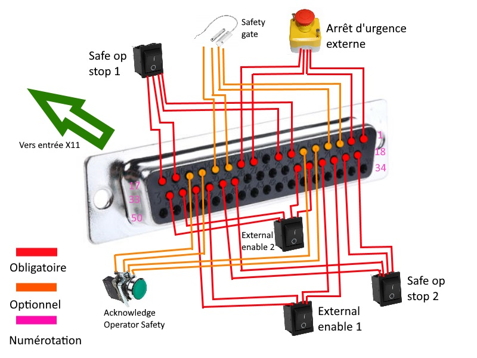

# Installation KUKA KR6 R900

Ce guide explique en détail l'installation du KUKA KR6 R900.

## 1 - Mise en place du connecteur X11

Le module de sécurité du module d'alimentation KR C4 du KUKA se base sur le branchement correct du connecteur X11 (connecteur DB50). À partir du [plan de connexion électrique](../KRC4_X11_external circuit.pdf) disponible pour le KR C4, les rajouts nécessaires à effectuer sur le X11 pour activer le KUKA sont les suivant :

* Arrêt d'urgence externe à 2 canaux (normalement fermé) 
* "Safe Op Stop" : interrupteur à 2 canaux (normalement fermé) 
* "Safe Stop2" : interrupteur à 2 canaux (normalement fermé)
* "External Enable1" : interrupteur à 2 canaux (normalement fermé) 
* "External Enable2" : interrupteur à 2 canaux (normalement fermé)  
* (*Optionnel*) "Acknowledge Operator Safety" : bouton poussoir à 2 canaux (normalement ouvert). Semble désactivé.
* (*Optionnel*) "Safety Gate" : bouton poussoir à 2 canaux (normalement ouvert). N'est pas nécessaire en mode T1/T2.

**Attention :** Pour chaque interrupteur/bouton à 2 canaux, il est nécessaire d'avoir véritablement 2 canaux. La mise en parallèle des canaux (pour être utilisé sur un bouton simple canal) entraîne un défaut du côté du module de sécurité du KR C4.

Le branchement final sur le connecteur est le suivant :

    

## 2 - Démarrage KR C4

Avant de démarrer le KR C4 assurez-vous que :

* le câble d'alimentation X20<>X30 du KUKA est branché ;
* le câble de donnée X21<>X31 du KUKA est branché ;
* la tablette (kuka smartpad) est branchée (X19) ;
* le connecteur X11 ainsi que ses éléments associés sont branchés ;
* le câble d'alimentation du KR C4 est branché ;

Démarrer le KR C4 en basculant le bouton vert sur la façade sur la position 1.

Attendez la mise en route de la tablette graphique.

Pour plus de facilité, passez en administrateur, pour cela :

* Appuyez sur le bouton kuka tout en bas à droite de la tablette
* Allez dans "configuration" > "User group"
* Sélectionnez "Log-on" en bas de l'écran
* En bas de la liste, sélectionnez "Administrator" et rentrez le mot de passe "KUKA", puis faites entrée.

Lors de la première mise sous tension, il vous ai demandé de suivre la procédure de star-up. Pour cela, appuyez sur le bouton kuka, puis "startup" et "startup wizard".

## 3 - Calibration

Arrivé à l'étape ?? du "startup wizard", il vous ai demandé de calibrer le bras. Pour ce faire, enclenchez les arrêts d'urgence, et mettez en place l'EMD, l'outil de calibrage Kuka.

## 4 - Utilisation manuelle du Kuka

Pour utiliser manuellement le bras robot :

* Démarrez le KR C4 comme précédemment.
* S'assurez que les éléments connectés au X11 soient configurés de la manière suivante :
  * Arrêt d'urgence déverrouillé.
  * "External enable" 1 et 2 court-circuité.
  * "Safe OP stop" 1 et 2 court-circuité.
* Assurez-vous que la zone de travail soit libérée. Prenez une distance de sécurité.
* Sur le smartpad, à l'aide de la clé, vérifiez que vous êtes en mode T1.
* Déverrouillez l'arrêt d'urgence du smartpad.
* Choisissez l'un des boutons gris à l'arrière du smartpad, appuyez sur le 1er cran du bouton, et restez y appuyer (à tout moment si vous appuyez à fond jusqu'au deuxième cran, le bras se mettra en sécurité).
* Si toutes les conditions sont réunies, le KR C4 produit un bruit électrique, et l'icône "I" tout en haut du smartpad tourne au vert. Les numéros des axes sur le côté droit de la tablette tournent aussi au vert.
* L'appui sur les touches "+" et "-" à côté d'un axe entrainera son mouvement. Pour augmenter la vitesse, appuyez sur la dernière touche "+" en bas du smartpad à côté de l'icône "main".
* Pour éteindre le KUKA, s'assurez d'être en administrateur, activez les deux arrêts d'urgence pour plus de sécurité, appuyez sur le bouton kuka, paramètre "shutdown", puis bouton "shutdown control PC", et enfin confirmez. 